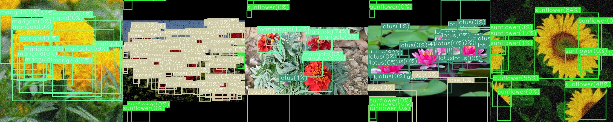

# <div align="center">Object Detection: YOLOv1</div>

---

## [Content]
1. [Description](#description)   
2. [Usage](#usage)  
2-1. [Model Training](#model-training)  
2-2. [Detection Evaluation](#detection-evaluation)  
2-3. [Result Analysis](#result-analysis)  
3. [Contact](#contact)   

---

## [Description]

This is a repository for PyTorch implementation of YOLOv1 following the original paper (https://arxiv.org/abs/1506.02640). 
we train our model using five different type of flower 1.rose, 2.lotus 3.hibscus 4.marigold 5.sunflower 





## [Usage]

#### Model Training 
 - You can train your own YOLOv1 model using various backbone architectures of ResNet18, ResNet34, ResNet50, ResNet101, VGG16, and VGG16-BN. If you wanna train YOLOv1 on your dataset from the scratch, add "--scratch" in training command like below.

```python
python train.py --exp my_test 
		--data voc.yaml 
```


#### Detection Evaluation
 - It computes detection metric via mean Average Precision(mAP) with IoU of 0.5, 0.75, 0.5:0.95. I follow the evaluation code with the reference on https://github.com/rafaelpadilla/Object-Detection-Metrics

```python
python val.py --exp my_test --data voc.yaml --ckpt-name best.pt
``` 
